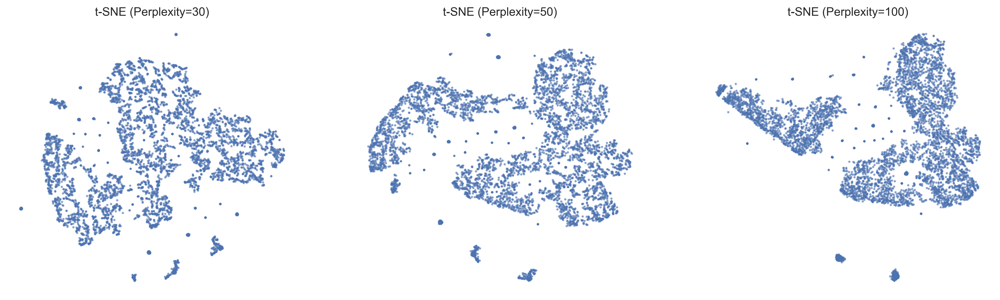
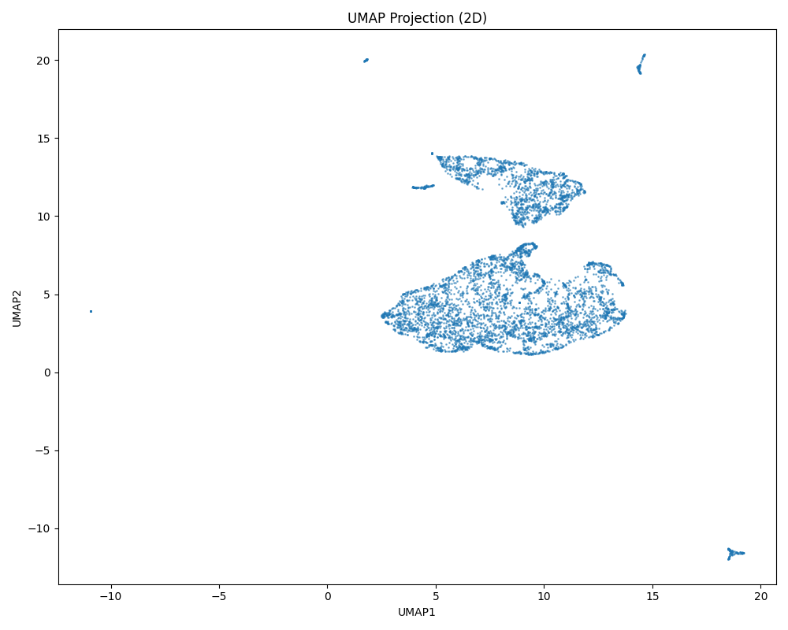
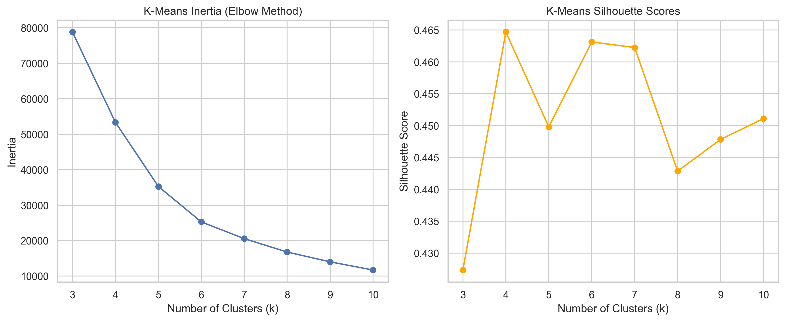
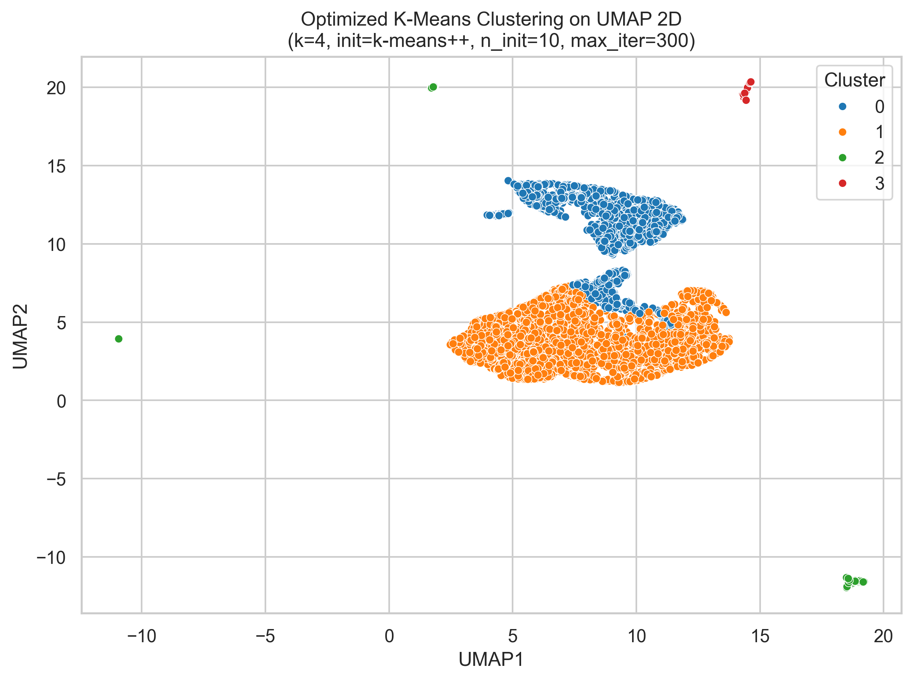
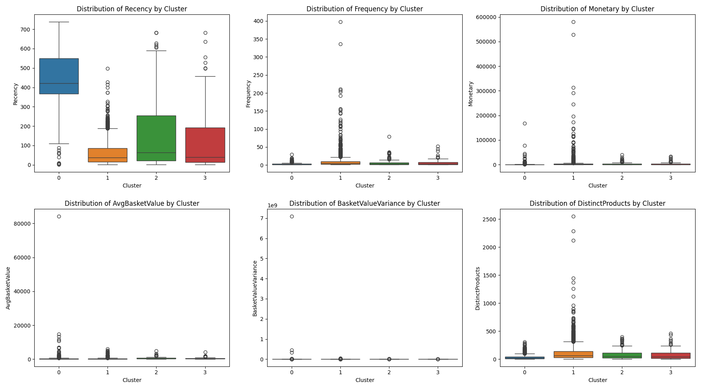
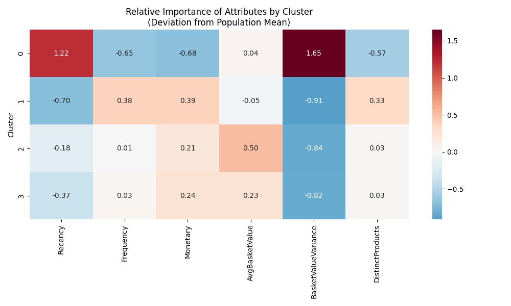
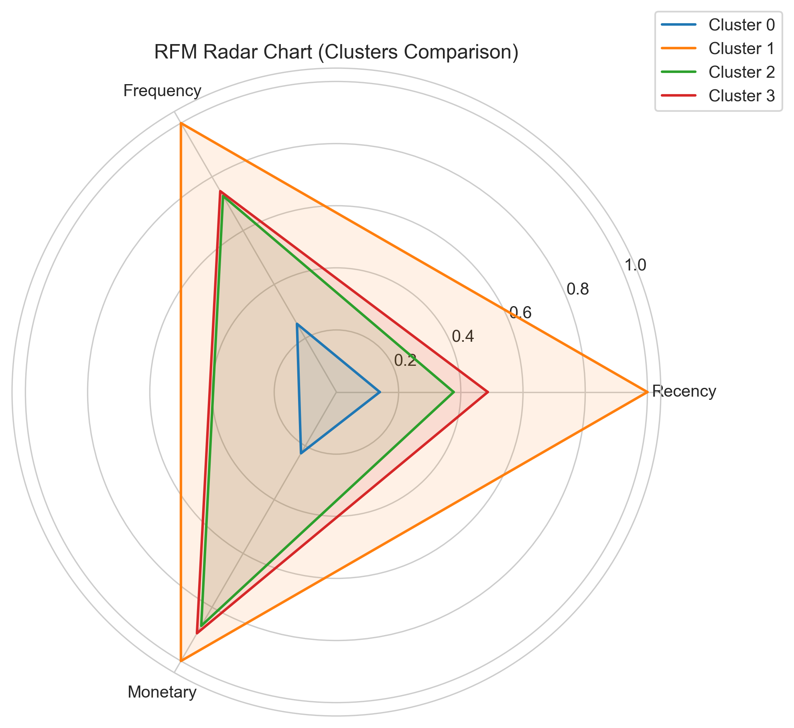

# Unsupervised Customer Segmentation

Customer segmentation is a strategic tool to unlock hidden patterns in business data.
This project was an opportunity for me to build a complete **unsupervised learning pipeline**, proceeding from raw transactional data to actionable customer personas using advanced dimensionality reduction and clustering techniques.

---

## Dataset

The dataset used is the **Online Retail II** dataset, available on Kaggle.
🔗 **Source**: [Kaggle - Online Retail II UCI](https://www.kaggle.com/datasets/mashlyn/online-retail-ii-uci)

It contains trans-national transactional data for a UK-based and registered non-store online retail between 01/12/2009 and 09/12/2011.
*   **Rows**: 1,067,371 transactions
*   **Columns**: Invoice, StockCode, Quantity, Price, Customer ID, Country, etc.
*   **Goal**: Group customers with similar purchasing behaviors to tailor marketing strategies.

---

## Overview

Here is the high-level workflow I designed to transform raw logs into insights:
1.  **Data Cleaning**: Removed noise like cancelled transactions and missing IDs.
2.  **Feature Engineering**: Created customer-level metrics (RFM, basket size, country).
3.  **Dimensionality Reduction**: Used UMAP to condense complex data into a visualizable space.
4.  **Clustering**: Applied K-Means to find natural groupings in that space.
5.  **Profiling**: Analyzed each group to define specific personas.

## 1. Feature Engineering

I started by aggregating the transactional data. For each customer, I calculated:
*   **RFM**: Recency (days since last buy), Frequency (number of purchases), Monetary (total spend).
*   **Basket Stats**: Average basket value, variance, and distinct products.
*   **Demographics**: Country of origin.

After engineering these features, I standardized them to ensure no single metric dominated the analysis.

## 2. Dimensionality Reduction (Experiments & Final Choice)

The feature space was high-dimensional and sparse, especially with the country one-hot encoding. I experimented with several techniques to find the best representation:

*   **PCA**: I tried this first, but as a linear method, it struggled to capture the complex, non-linear relationships in customer purchasing behavior. The explained variance was too spread out.
*   **t-SNE**: Great for visualization, but computationally expensive and doesn't preserve global structure well enough for clustering.
*   **UMAP (Chosen)**: This was the winner. It preserves both local and global structure and handles non-linear data beautifully.

To better illustrate this decision, here is the **t-SNE** projection I generated. It resulted in a less structured "blob" compared to UMAP:


t-SNE Projection: Groupings are less distinct.

I used UMAP to project the data into **10 dimensions** for the clustering algorithms (to retain more information) and **2 dimensions** for visualization.


UMAP 2D Projection of the customer data. You can clearly see dense regions, suggesting natural groups.

## 3. Clustering (Model Selection)

With the UMAP embeddings ready, I tested four different clustering algorithms to find the most stable segments:

*   **DBSCAN / HDBSCAN**: These density-based models struggled with the varying densities of customer data, resulting in too much "noise" (unclassified customers).
*   **Gaussian Mixture Models (GMM)**: This performed well and is flexible with elliptical shapes, but the results were slightly less stable than K-Means.
*   **K-Means (Chosen)**: This algorithm gave the best balance of interpretability and performance.

I used the **Elbow Method** and **Silhouette Scores** to determine the optimal number of clusters. **k=4** emerged as the clear winner with a **Silhouette Score of 0.46**, offering distinct and actionable customer groups.


Left: Elbow curve showing the optimal 'k'. Right: Silhouette score confirming cluster separation.


The four resulting customer segments.

## 4. Profiling & Results

Once I had the clusters, I analyzed their "personalities" by looking at their feature distributions.


Feature distributions across clusters.

I also created a heatmap to see how each cluster compares to the average customer.


Relative importance of attributes. Red means higher than average, blue means lower.

To clearly visualize these profiles, I utilized a **Radar Chart**, which makes it easy to compare the clusters across key dimensions (RFM):


Comparison of customer segments across Recency, Frequency, and Monetary value.

### My Personas
Based on these insights, I defined 4 personas:
*   **Cluster 0**: *The Occasional Spender* - Low frequency, low spend.
*   **Cluster 1**: *The Loyal Regular* - Buys often, decent basket size.
*   **Cluster 2**: *The Big Spender* - High monetary value, very active.
*   **Cluster 3**: *The Window Shopper / Returned* - High activity but low revenue (or many returns).

*These labels are examples derived from typical runs, check `cluster_profiles.csv` for the exact stats of your latest run*

---

## How to Run It

I structured the project to be fully automated.

### Prerequisites
Make sure you have Python installed. Then install the dependencies:
```bash
pip install -r requirements.txt
```

### Running the Pipeline
I wrote a `main.py` script that handles everything—from loading raw data to generating the plots above.

```bash
python main.py
```

This will:
1.  Process `data/raw/online_retail_II.csv`.
2.  Save cleaned features to `data/processed/`.
3.  Train model and save clusters to `data/processed/clusters_FINAL.csv`.
4.  Export all visualizations to `images/`.

---

## Project Structure

*   `src/`: Contains all the python logic (`data_prep.py`, `preprocessing.py`, `clustering.py`, `profiling.py`).
*   `notebooks/`: My original experiments where I tested different algorithms.
*   `main.py`: The entry point to run the production pipeline.
*   `data/`: Stores raw and processed CSVs (ignored by git).
*   `images/`: Stores generated plots.
